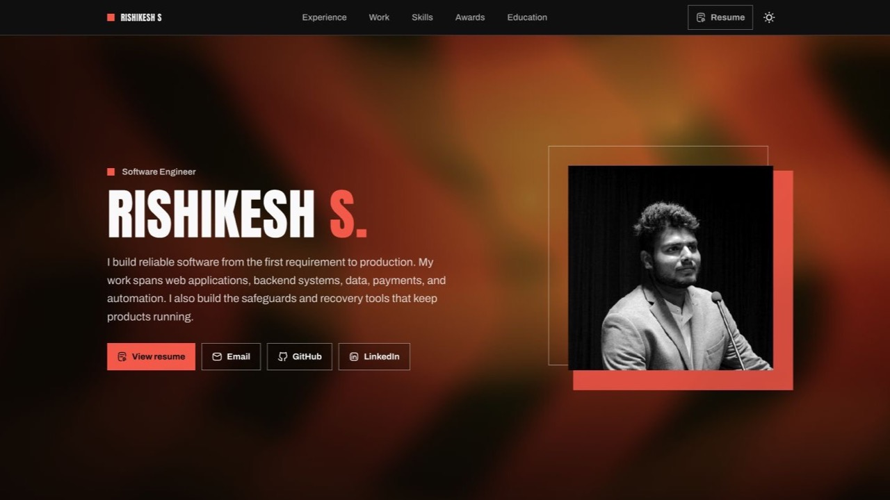

# Modern Portfolio Template

A responsive portfolio template built with Astro 7, React 19, Tailwind CSS 4, and Framer Motion.



## Features

- Responsive single-page portfolio
- Light and dark themes
- Reduced-motion support
- Static Astro output with Vercel Analytics
- Content managed from one TypeScript file
- Type-safe MDX blog with sitemap generation

## Requirements

- [Bun 1.3.14](https://bun.sh/)
- Node.js 22.12 or newer (required by Astro 7)

## Local development

```bash
git clone https://github.com/rkeshs/my-portfolio.git
cd my-portfolio
bun install
bun run dev
```

Open `http://localhost:4321`.

Copy `.env.example` to `.env` when you need production URL generation locally. Set `ORIGIN` to your public URL in the production deployment environment so Astro can generate canonical URLs correctly.

## Commands

| Command                | Purpose                                            |
| ---------------------- | -------------------------------------------------- |
| `bun run dev`          | Start the development server                       |
| `bun run check`        | Run Astro and TypeScript diagnostics               |
| `bun run format`       | Format supported files with Oxfmt                  |
| `bun run format:check` | Check formatting without changing files            |
| `bun run lint`         | Run Oxlint correctness and code-quality checks     |
| `bun run typecheck`    | Run TypeScript and Astro diagnostics               |
| `bun run build`        | Create the production build in `dist/`             |
| `bun run preview`      | Preview the production build locally               |
| `bun run astro sync`   | Regenerate Astro types after configuration changes |

## Update portfolio content

Edit [`src/lib/data.ts`](src/lib/data.ts) to update personal details, work experience, skills, projects, awards, and education. Replace the image referenced by `personalInfo.profilePicture` to update the portrait.

## Publish a blog post

Add an `.md` or `.mdx` file under [`src/content/blog`](src/content/blog) with this frontmatter:

```yaml
---
title: "Post title"
description: "A concise summary for lists and search results."
pubDate: 2026-07-18
draft: true
---
```

Set `draft` to `false` to include the post in `/blog`, static article routes, and the sitemap. An optional `updatedDate` accepts the same date format.

Set `ORIGIN` to the public site URL in production. Astro uses it for canonical links and sitemap generation.

## Production verification

```bash
bun install --frozen-lockfile
bun run astro sync
bun run format:check
bun run lint
bun run typecheck
bun run build
```

Dependencies are pinned to exact versions in `package.json`; update `package.json` and `bun.lock` together with Bun.

## Deployment

The site builds to static files in `dist/` and can be deployed to Vercel or any static host. The canonical site URL comes from the `ORIGIN` environment variable.

## License

MIT © 2026 Rishikesh S.
